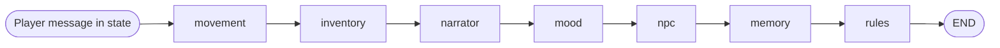
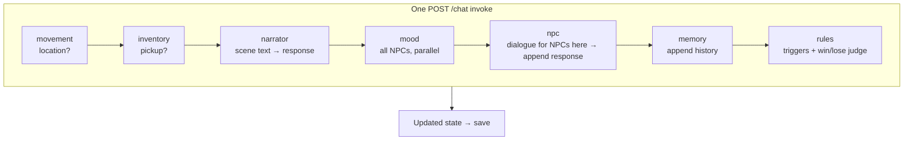
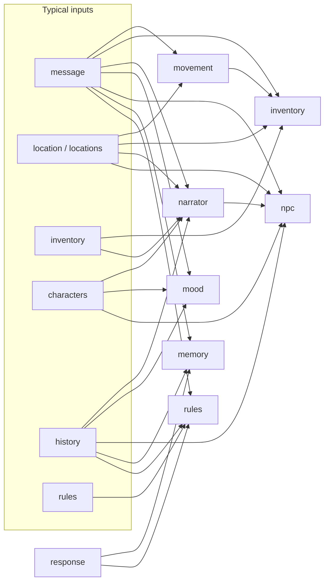

# LangGraph RPG — Pipeline and Graph

This document describes the LangGraph used in `app.py`: how one player turn flows through nodes, what each node does, and diagrams you can render in any Mermaid-compatible viewer (GitHub, VS Code, etc.).

## Overview

LangGraph runs **one linear path per player message**. There are **no conditional edges**: every node runs in the same order on every turn. Each node returns a **partial state update** (a dict) that merges into the shared `State`:

- `message`, `response`, `history`
- `narrator`, `player`, `characters`, `location`, `locations`, `rules`, `game_title`
- `inventory`, `turn_count`, `paused`

**Execution:** Flask `POST /chat` sets `state["message"]` (after sanitization), then `chain.invoke(state)` walks the graph once. The returned state is persisted under `sessions/`.

## Node order and responsibilities

| Order | Node       | Role |
|-------|------------|------|
| 1 | `movement` | LLM: did the player move? May update `location`. Bumps `turn_count`. |
| 2 | `inventory` | LLM: pickup? May update `locations` and `inventory`, or set a short `response` if full. Bumps `turn_count`. |
| 3 | `narrator` | Main scene narration → `response`. Uses current location, items, inventory, characters present, history. Bumps `turn_count`. |
| 4 | `mood` | For each entry in `characters`, parallel LLM calls adjust `mood` (1–10). Bumps `turn_count`. |
| 5 | `npc` | For each character in the **current** location, LLM dialogue appended to `response`. Bumps `turn_count`. |
| 6 | `memory` | Appends one turn to `history` (`Player: …` plus full `response`), capped by `HISTORY_LIMIT`. Bumps `turn_count`. |
| 7 | `rules` | Substring match on `message` for `trigger_words`; else LLM judges WIN / LOSE / CONTINUE and may append game-over text. Bumps `turn_count`. |

**Information flow:** World-changing steps (`movement`, `inventory`) run before narration. `narrator` produces the base `response`; `npc` appends lines. `memory` records the combined output; `rules` sees the latest player message and full response.

## Diagram: control flow (linear pipeline)



## Diagram: one turn, top-down



## Diagram: data each stage tends to use

Conceptual only — some nodes also read `narrator` for model selection, etc.



(`response` is the narration field; it grows when `narrator` and `npc` append text.)

## Source reference

The graph is built and compiled in `app.py`:

```python
graph = StateGraph(State)
graph.add_node("movement", movement_node)
graph.add_node("inventory", inventory_node)
graph.add_node("narrator", narrator_node)
graph.add_node("mood", mood_node)
graph.add_node("npc", npc_node)
graph.add_node("memory", memory_node)
graph.add_node("rules", rules_node)

graph.set_entry_point("movement")
graph.add_edge("movement", "inventory")
graph.add_edge("inventory", "narrator")
graph.add_edge("narrator", "mood")
graph.add_edge("mood", "npc")
graph.add_edge("npc", "memory")
graph.add_edge("memory", "rules")
graph.add_edge("rules", END)

chain = graph.compile()
```

## Mental model

The structure is a **straight pipeline** of staged LLM and rule steps, not a branching narrative graph. Some nodes **no-op** when there is nothing to do (e.g. no NPCs in the room), but the **edge sequence is fixed**.
