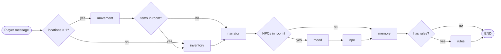
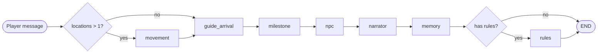

# LangGraph RPG — Pipeline, Graph Templates, and How to Create New Ones

This document describes the graph template system in `app.py`: how graphs are registered, what each node does, and how to create a new graph template for a different type of story.

## Graph Template System

The engine supports multiple graph templates. Each template is a different LangGraph pipeline tailored to a specific story type. Templates are registered in `GRAPH_REGISTRY` and selected at runtime based on the game JSON's `graph_type` field.

### How it works

1. Each template has a builder function: `build_standard_graph()`, `build_social_graph()`, etc.
2. Builder functions create a `StateGraph(State)`, wire nodes and edges, and return `g.compile()`
3. Compiled graphs are stored in `GRAPH_REGISTRY` at startup (built once, reused for all requests)
4. `get_compiled_graph(graph_type)` looks up the registry, falls back to `"standard"` for unknown types
5. The game JSON declares `"graph_type": "social"` (or omits it to default to `"standard"`)
6. `_graph_type` is stored in the game state and persists through saves

### Current templates

| Template | Graph Type | Nodes | Use Case |
|----------|-----------|-------|----------|
| Standard | `"standard"` | movement, inventory, narrator, mood, npc, memory, rules | Exploration + NPCs + items + win/lose |
| Social | `"social"` | movement, guide_arrival, milestone, npc, narrator, memory, rules | Dialogue-focused with milestone progression |

## State

All templates share the same `State` TypedDict. A node returns a partial dict with only the fields it changed — LangGraph merges it into the full state.

```
message              str    — current player input
response             str    — current narrative response (grows as nodes append)
history              list   — list of turn strings ("Player: ...\nNarrator: ...")
narrator             dict   — {model, prompt}
player               dict   — {name, background, traits}
characters           dict   — NPC definitions keyed by name
location             str    — current location key
locations            dict   — all location definitions
rules                dict   — {win, lose, trigger_words}
game_title           str    — title of the game
opening              str    — opening narrative text
inventory            list   — items the player carries
turn_count           int    — number of completed turns
paused               bool   — whether game is paused
milestones           list   — ordered list of milestone strings from game JSON
milestone_progress   int    — index of current milestone (0 = first)
guide                str    — name of the guide NPC who follows the player
```

Additionally, `_graph_type` is stored as a private key (not in the TypedDict) to persist the graph selection through saves.

## Node Reference

### Nodes used by both templates

| Node | LLM Call? | What It Does |
|------|-----------|-------------|
| `movement_node` | Yes (classifier) | Asks LLM if the player is trying to move. Returns location key or STAY. Updates `state["location"]` if moving. |
| `narrator_node` | Yes (creative) | Main storytelling. Sends location, inventory, NPCs, history, and player message to LLM. Returns scene narration as `state["response"]`. |
| `npc_node` | Yes (creative, per NPC) | For each NPC in the room, generates in-character dialogue. Appends to `state["response"]` with mood indicator. |
| `memory_node` | No | Combines player message + response into one string, appends to `state["history"]`, sets `turn_count`. |
| `rules_node` | Yes (classifier) | Checks trigger words (string match) and win/lose conditions (LLM judges). If milestones exist, blocks WIN until all complete. |

### Nodes only in standard template

| Node | LLM Call? | What It Does |
|------|-----------|-------------|
| `inventory_node` | Yes (classifier) | Asks LLM if the player is picking up an item. Moves item from room to inventory with weight limit check. |
| `mood_node` | Yes (classifier, per NPC) | For each NPC in the room, asks LLM: mood goes UP, DOWN, or SAME. Adjusts mood value (1-10 scale). Runs in parallel via thread pool. |

### Nodes only in social template

| Node | LLM Call? | What It Does |
|------|-----------|-------------|
| `guide_arrival_node` | No | If the guide NPC isn't in the current room, moves them here. Removes guide from old room, adds to current room. Sets hint for narrator. |
| `milestone_node` | No | Checks if the player's message contains the current milestone (loose string match). Advances progress, blocks skip-ahead, or passes through. |

## Standard Graph

```
entry → route_graph_entry → movement or inventory
movement → route_after_movement → inventory or narrator
inventory → narrator
narrator → route_after_narrator → mood or memory
mood → npc
npc → memory
memory → route_after_memory → rules or END
rules → END
```

Conditional edges skip nodes when unnecessary:
- Skip movement if only 1 location
- Skip inventory if no items in current room
- Skip mood+npc if no NPCs in current room
- Skip rules if no win/lose conditions and no trigger words



## Social Graph

```
entry → route_social_entry → movement or guide_arrival
movement → guide_arrival
guide_arrival → milestone
milestone → npc
npc → narrator
narrator → memory
memory → route_after_memory → rules or END
rules → END
```

Note: NPC runs **before** narrator so the narrator's choices appear last in the output.



## Game JSON Fields for Social Graph

The social graph introduces these game JSON fields:

```json
{
  "graph_type": "social",
  "guide": "maya",
  "milestones": [
    "Ask Sam on a date",
    "Hold hands with Sam",
    "Kiss Sam",
    "Tell Sam you love them"
  ]
}
```

- `graph_type` — selects which graph template to use
- `guide` — the NPC key that follows the player between locations
- `milestones` — ordered list of goals the player must achieve in sequence

## How to Create a New Graph Template

Follow these steps to add a new template (e.g., `"combat"`):

### Step 1: Design the pipeline

Decide which nodes your story type needs. You can reuse existing nodes and/or create new ones.

Questions to answer:
- Does the player move between locations? → include `movement_node`
- Does the player pick up items? → include `inventory_node`
- Do NPCs have shifting moods? → include `mood_node`
- Do NPCs speak? → include `npc_node`
- Are there milestones? → include `milestone_node`
- Is there a guide NPC? → include `guide_arrival_node`
- Are there win/lose conditions? → include `rules_node`
- Always include `narrator_node` and `memory_node`

### Step 2: Create any new nodes

Add your node function in `app.py` near the existing nodes. A node function:
- Takes `state: State` as its only argument
- Returns a partial dict with only the fields it changed
- Returns `{}` if it has nothing to do (early exit)

Pattern for a classifier node (LLM picks from fixed options):
```python
def my_node(state: State) -> State:
    # Early exit if nothing to check
    if not some_condition:
        return {}

    model = state["narrator"].get("model", DEFAULT_MODEL)
    llm = get_llm(model)
    prompt = f"... Reply with ONLY one word: OPTION_A or OPTION_B"
    result = llm.invoke(prompt).strip().upper()

    if "OPTION_A" in result:
        return {"some_field": new_value}
    return {}
```

Pattern for a pure code node (no LLM):
```python
def my_node(state: State) -> State:
    if not some_condition:
        return {}
    # Do logic, return changed fields
    return {"field": new_value}
```

### Step 3: Create routing functions (if needed)

If your graph has conditional edges, add routing functions near the existing ones (after the `# --- Graph routing helpers ---` section). A routing function:
- Takes `state: State`
- Returns a string (the name of the next node)

```python
def route_my_entry(state: State) -> str:
    if some_condition:
        return "node_a"
    return "node_b"
```

### Step 4: Write the builder function

Add `build_my_graph()` in the `# --- Graph builders ---` section:

```python
def build_my_graph():
    """Build the my-type graph: node_a -> node_b -> ..."""
    g = StateGraph(State)

    # Register nodes
    g.add_node("node_a", node_a_function)
    g.add_node("node_b", node_b_function)

    # Entry point (conditional or fixed)
    g.set_conditional_entry_point(
        route_my_entry,
        {"node_a": "node_a", "node_b": "node_b"},
    )
    # Or fixed: g.set_entry_point("node_a")

    # Wire edges
    g.add_edge("node_a", "node_b")       # unconditional
    g.add_conditional_edges(              # conditional
        "node_b",
        route_function,
        {"option_x": "node_x", "option_y": "node_y"},
    )
    g.add_edge("last_node", END)

    return g.compile()
```

### Step 5: Register it

Add your template to `GRAPH_REGISTRY`:

```python
GRAPH_REGISTRY = {
    "standard": build_standard_graph(),
    "social": build_social_graph(),
    "combat": build_my_graph(),  # <-- add here
}
```

### Step 6: Add new State fields (if needed)

If your nodes need new state fields:
1. Add them to the `State` TypedDict
2. Add them to `_build_state_from_json()` with a default value
3. Add them to `load_game()` with the same default
4. If they should show in the frontend, add them to the `/status` and `/chat` response payloads

### Step 7: Create a test game JSON

Create a game JSON in `games/` with `"graph_type": "your_type"`. Include all the fields your nodes expect.

### Step 8: Test

1. **Unit test nodes from the command line:**
```bash
source ~/open-webui-env/bin/activate
python3 -c "
from app import my_node
result = my_node({...test state...})
print(result)
"
```

2. **Verify the graph compiles:**
```bash
python3 -c "
from app import get_compiled_graph
g = get_compiled_graph('my_type')
print('Compiled:', g is not None)
"
```

3. **Play test in the web app:**
   - Delete the DB: `rm rpg.db`
   - Restart Flask
   - Start a new adventure with your test game
   - Play through several turns

4. **Verify backward compatibility:**
   - Play an existing standard game — should work identically
   - Load a saved game from before the change — should default to standard

### Step 9: Deploy

```bash
git add app.py web/src/routes/play/+page.svelte  # and any other changed files
git commit -m "feat: add combat graph template"
git push
# Game JSONs are gitignored — rsync separately:
rsync -avz games/ root@45.132.241.60:/var/www/rpg-engine/games/
ssh root@45.132.241.60 "rm -f /var/www/rpg-engine/rpg.db && systemctl restart rpg-flask"
```

## Key Design Decisions

### Why graph templates instead of one graph with more conditional edges?
As you add more story types (combat, mystery, survival), a single graph with conditional skips for everything becomes bloated and hard to reason about. Templates keep each story type's pipeline clean and explicit.

### Why NPC before narrator in the social graph?
If narrator runs first and ends with numbered choices, then NPC dialogue appears after the choices — confusing for the player. Swapping the order means NPCs speak first, then the narrator wraps up with the scene and choices. The choices are always the last thing the player sees.

### Why string matching for milestones instead of LLM?
LLM-based milestone judging was unreliable — it couldn't consistently determine if "I would love to spend the afternoon with you" achieved "Go on a date." String matching is instant, deterministic, and free (no LLM call). The narrator offers milestones as choices, and the player's selection contains the milestone text.

### Why does the rules node check milestone progress?
Without this check, the LLM rules judge could trigger WIN based on romantic narrative even when the player hasn't completed all milestones. The rules node now blocks WIN until `milestone_progress >= len(milestones)`. LOSE can still fire at any time.

### Why does the guide NPC follow the player?
Social stories are about dialogue. An empty room with no one to talk to breaks the flow. The guide ensures there's always at least one NPC present for conversation, even when the player moves to a location with no other characters.
